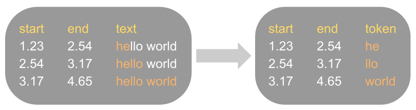
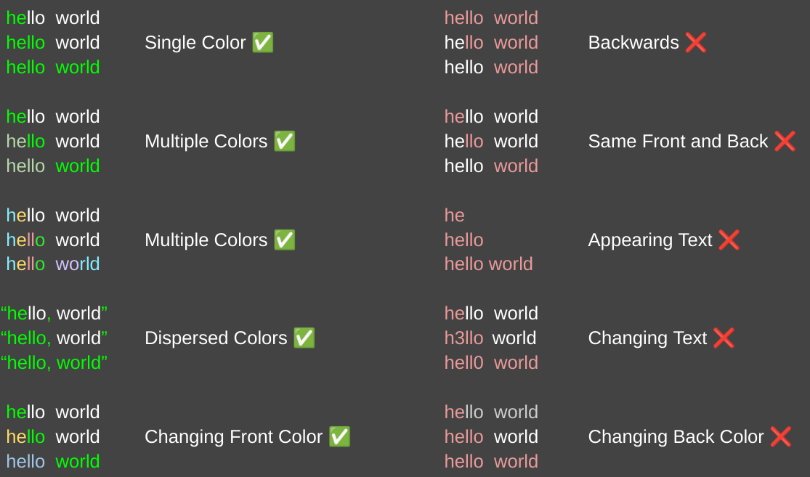
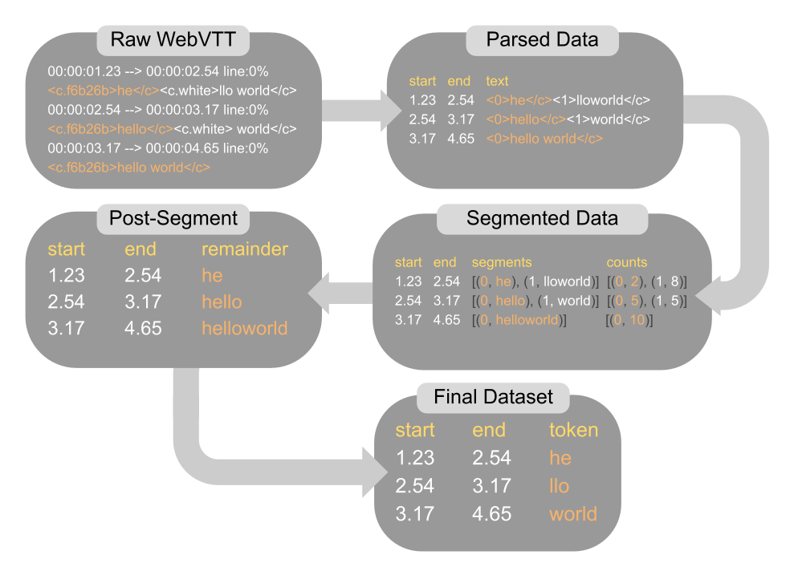
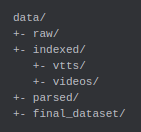

<h1>Purpose</h1>

This is intended to parse publicly available karaoke-style subtitles (<b>WebVTT format</b>)
into datasets containing timestamped tokens.

The parsing process is intended to be as simple as possible,
while also retaining as much of the information present in the original data.

The below figure summarizes what this process does.

___

<h1>Assumptions about the Data</h1>

1. The original subtitles data are in <b>WebVTT</b> file format that supports color formatting.
2. The parsing process takes a <b>color-based</b> approach to separate the text into the tokens (see examples below).
   1. If your subtitles do not use color to separate spoken text in a line, 
   this repository will not help you. I suggest looking elsewhere.
3. The entire line of text must be <b>visible</b> and <b>unchanged</b> the entire time it's displayed (see examples below).

Below are <u>examples</u> and <u>non-examples</u> of supported subtitle formatting.</h3>

---
<h1>High-Level Overview</h1>

Below is a high-level overview of the data parsing pipeline.

___

<h1>Tutorial</h1>

<h2>Tools</h2>

- Rust

- Python

- [YT-DLP](https://github.com/yt-dlp) (default, but optional: see below)

<h2>Steps</h2>
<h3>1. Create the below directories</h3>

(Note: the `videos/` directory is optional; see details below)

<h3>2. Attain WebVTT files</h3>

<h4>Option 1: Use `yt-dlp`</h4>

1. `cd` into `data/raw/`

2. Type the following into terminal:
`yt-dlp --ignore-errors --continue --no-overwrites --download-archive progress.txt 
    --skip-download --write-sub --sub-lang {language of subtitles (en/ja/etc.)} "{URL of playlist}"`

<b>Note:</b> running the above will download just VTT files, 
but (OPTIONALLY) by removing the `--skip-download` tag you can also download their corresponding videos.
Just make sure to have a `videos/` directory and have the videos in `.webm` format before proceeding.

<h4>Option 2: Use other means</h4>

1. Attain WebVTT files through some other means.

2. Place them in `data/raw/` (default option), or in a custom directory.

<h3>3. Run `src/main.rs ` (to index and parse the files)</h3>

- `index_files(include_and_require_videos=false)`

  - If you intend to also download videos, set `include_and_require_videos=true` (false by default).

- `parse_files(custom_input_directory=None, custom_output_directory=None)`

  - (OPTIONAL) Specify a custom input (`data/indexed/` default)
   and output (`data/parsed/` default) directory for the `parse_files()` function.

<h3>4. `cd` to `data_processing/`</h3>

- (because the below script uses relative paths)

<h3>5. Run `data_processing/parsed_to_tokens.py`</h3>

- If a custom output was specified in the parsing step, this function's input directory should be that custom output.

<h3>6. Enjoy the final* generated dataset!</h3>
*further cleaning is left to the user

Sidenote: the `data_processing/stage_{1/2/3/4}_processing.py` files are available for debugging purposes.

