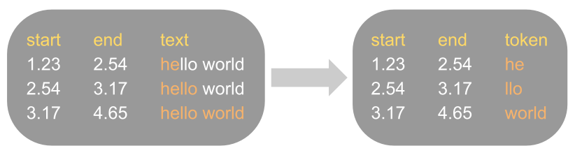
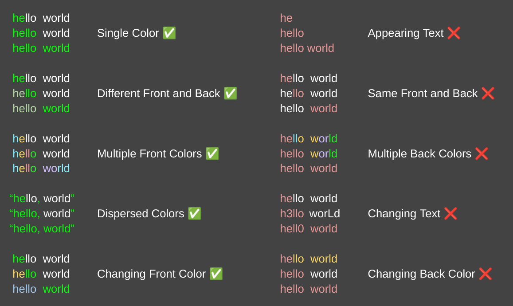

<h1>Purpose</h1>

This is intended to parse publicly available karaoke-style subtitles found on YT into datasets containing timestamped tokens.

The parsing process is intended to be as simple as possible, while also retaining as much of the information present in the original data.

The below figure summarizes what this process does.



___

<h1>Tutorial</h1>

<h2>Notes</h2>
- Ran this from Arch Linux, so the commands might be different for other OSes.
- requires yt-dlp, rust, and python

<h2>Steps</h2>
<h3>1. Create the below directories at project root:</h3>
```
   - data/
       - raw/
       - indexed/
         - vtts/
         - videos/
       - parsed/
       - final_dataset/
```
<h3>2. `cd` into `data/raw/`</h3>

<h3>3. Type the below command into terminal:</h3>
    ```bash
    yt-dlp --ignore-errors --continue --no-overwrites --download-archive progress.txt --write-sub --sub-lang {language of subtitles (en/ja/etc.)} "{URL of playlist}"
    ```
    <p>Note that some videos may be in formats other than .webm, or may not come with subtitles (which may be in a different language than the one specified).
    It is up to you to sort out these discrepancies manually.</p>

<h3>4. Run `src/main.rs `</h3>

<h3>5. `cd` to `data_processing/` (because the below script uses relative paths)</h3>

<h3>6. Run `data_processing/parsed_to_tokens.py`</h3>

<h3>7. Enjoy the final* generated dataset!</h3>
*further cleaning is left to the user

___

<h1>Assumptions about the Data</h1>

1. The original subtitles data are in vtt format that supports <> formating tags.
2. The parsing process takes a <u>color-based</u> approach to separate the text into the tokens (see examples).
3. The entire line of text must be <u>visible</u> and <u>unchanged</u> the entire time it's displayed (see examples).

Below are <u>examples</u> and <u>non-examples</u> of supported subtitle formatting.</h3>




