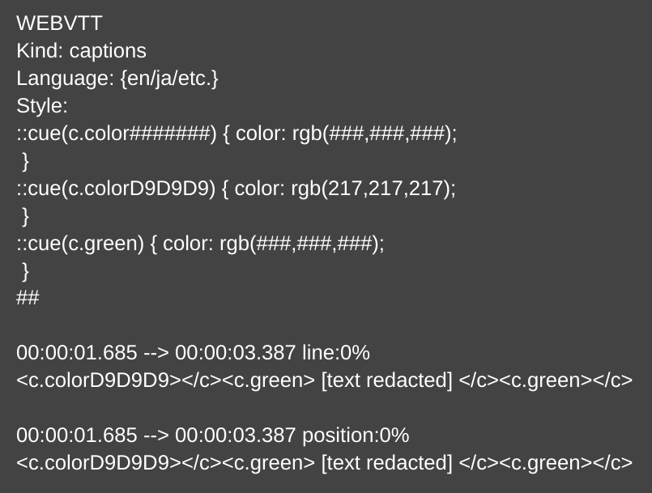

<h1>WEBVTT Assumptions</h1>



The above is the kind of WEBVTT's the parsing code in `src/parse_vtt.rs` expects.

Key assumptions about it are the following:
1. There must be a style block with cues and ends with ##.
   1. I am aware that a solution to compensate for other cases (e.g., no style block) could be done; I simply don't have the interest, as this serves well enough for the WebVTT's I'm working with.
2. I have since been aware that the `##:##:#.### --> ##:##:#.###` lines may come after line containing only integer indexes like `1`, `2`, `3`, etc. I have not tested whether the parsing code can handle this, but will say it here as a warning.
   1. Example: 
      ```
      1
      00:00:00.000 --> 00:00:01.000
      This is the first line.
      
      2
      00:00:01.000 --> 00:00:02.000
      This is the second line.
      ```
3. Also (last time I checked), the code relies on the presence of empty lines between the subtitle lines. Just mentioning this in case your WEBVTT's look something like the following:
    ```
    00:00:00.000 --> 00:00:01.000
    This is the first line.
    00:00:01.000 --> 00:00:02.000
    This is the second line.
    ```

<h1>Expected Parsing Output</h1>

If, in light of these limitations, you want to modify the parsing code or make your own, below is the expected output of the parsing code in `src/parse_vtt.rs`,
so that it works with the rest of the code.

For each WebVTT, the corresponding CSV that contains the parsed data should have the following columns:
1. `start_time` (string): The start time of the cue.
2. `end_time` (string): The end time of the cue.
3. `text` (string): The text of the cue. IMPORTANT: in place of each color tag (of the form `<c.{something}>`), 
there should be a POSITIVE integer number corresponding to that color tag of the form `<#>` (`<1>`, `<17>`, etc.).
4. `line` (integer): This is the `line:##%` parameter that may or may not appear after the `##:##:#.### --> ##:##:#.###`.
   1. If there is no `line` parameter, it is assumed to be `-1`.
   2. Otherwise, you just need to extract the number `n` from the `line:n%` parameter (where `0 <= n <= 100`).